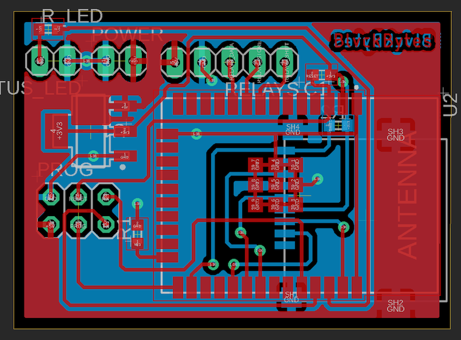

# WateringCtl

A web-based solenoid-valve controller used for watering the garden, plants and the like.

* [Requirements](#requirements)
* [Hardware](#hardware)
  * [usb2serial](#usb2serial)
  * [wifi](#wifi)
  * [relays](#relays)
## Requirements

* [x] Accomplish all I/O over WiFi
* [x] Long WiFi range to reach the shed
* [x] No external power-supply
* [x] USB connection to debug/upload code
* [ ] Update firmware over WiFi
* [ ] Status-LED where blinking-speed indicate system-states
* [x] Control as many valves as needed by having modular boards using shift-registers
* [x] Run a scheduler on-board that can be fully configured
* [x] Switch valves manually
* [x] Store representative string names for each valve
* [x] Disableable intervals, days and valves
* [ ] Mobile-friendly web-UI

## Hardware

I use AutoDesk Eagle to design my PCBs, you can find the projects below in `hardware`.

### usb2serial

Converts USB signals to RX, TX, Reset and Programming-Bootmode signals and is used to flash code onto the micro as well as debug through the serial monitor. It's mounted in the project's enclosure and provides a relatively modern port to interface with computers. With this, I can use cheap barebones ESP SoC's without the surrounding arduino-like development board.

### wifi

This board plugs straight into the usb2serial module and represents the most barebones wifi circuit possible. Besides the 3.3V regulation as well as driving an external status-led and the relay-board breakouts, there's not much on there. The antenna is also broken out to an external antenna screw-connector to ensure proper wifi reception.

### relays

This board requires 5VDC to power logic, 12VDC for the relays and 24VAC to control the valves using said relays. The 595 shift-register controls all eight relays through on-board transistors safely, since each relay has it's own reverse diode to catch collapsing field currents. Boards can be chained together to have as many valves as you'd like, since D_IN and D_OUT are exposed separately.